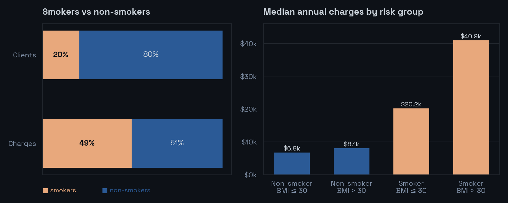
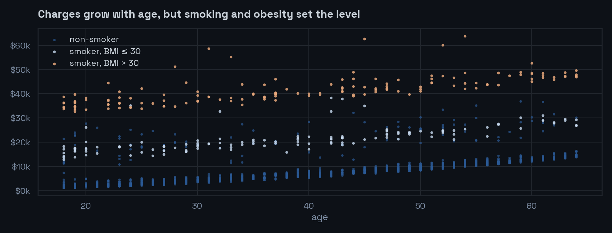

<p align="center">
  
</p>

## Business question

An insurer wants to understand **what drives medical charges** and **which client groups should be priced or managed differently**. The dataset has 1,338 policies with age, sex, BMI, number of children, smoking status, region and annual charges.

## Results

<p align="center"></p>

- **Smoking is the main cost driver.** Smokers are 20% of clients but 49% of all charges; their median charges are 4.7 times higher ($34.5k vs $7.3k).
- **Smoking combined with obesity is the most expensive segment.** Smokers with BMI above 30 have a median of $40.9k, six times more than non-smokers with BMI up to 30. Obesity alone barely moves the needle for non-smokers ($8.1k vs $6.8k).
- **Costs are concentrated.** The top 10% of clients account for 32% of all charges.

<p align="center"></p>

- **Age raises costs gradually** within every group (median $13.4k for 55+ vs $7.7k for the rest), but smoking and BMI decide which "band" a client is in.
- **Extreme claims are rare.** Only 7 clients exceed three standard deviations, and they make up 2.3% of charges, so pricing should focus on stable risk factors rather than outliers.
- **Regional differences are moderate** (medians from $8.7k to $10.0k), which leaves room for light geographic tariff tuning rather than separate pricing.

## Segments and suggested approach

| Segment | Profile | Approach |
|---|---|---|
| Healthy | non-smoker, normal BMI, low charges | discounts and long-term plans to retain them |
| At risk | smoker and/or high BMI | early prevention programs, risk-based pricing |
| Age risk | 55+ with high charges | age-adjusted plans |
| Emergency | charges above 3σ | case monitoring |
| Regional anomalies | far from regional median | review regional tariffs |

## What the notebook does

1. **Cleans the data.** Converts text values in `children` (`zero` → 0), fixes region typos with fuzzy matching (`northvest` → `northwest`), removes impossible ages.
2. **Explores distributions and outliers** with boxplots and a correlation matrix.
3. **Builds risk flags:** emergency care (z-score > 3), regional outliers (distance from the regional median in MAD units) and hidden risk behaviour (smoker with BMI > 30 but low charges, none found).
4. **Compares charges** across smoking status, region, sex and number of children, then turns the findings into segments with a business action for each.

## Limitations and next steps

- 47 records (3.5%) could not be matched to a region and are kept as `unknown`; a proper region dictionary would fix this.
- The regional outlier rule (1.5 MAD) flags 30% of clients, which is too loose for operational use; a stricter threshold or a model-based approach would be the next step.
- A regression model on age, BMI and smoking would quantify each factor's contribution and could serve as a pricing baseline.

## Repository structure

```
├── insurance_analysis.ipynb            # full analysis
├── insurance_small.csv   # source data
├── images/               # charts for this README
└── requirements.txt
```

## How to run

```bash
pip install -r requirements.txt
jupyter notebook insurance_analysis.ipynb
```

## Stack

Python · pandas · NumPy · SciPy · seaborn · Matplotlib · RapidFuzz · Jupyter
